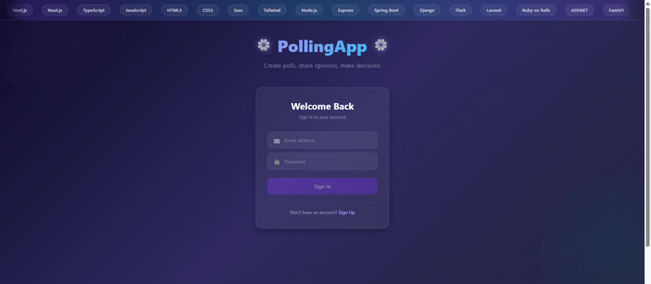

# 📊 Polling App

> ⚠️ **Note:** This project is currently under active development and is not yet complete. Features are being added incrementally.

A modern, full-stack polling application that allows users to create, manage, and vote on polls with real-time results. Built with Spring Boot backend and Angular frontend, featuring user authentication, profile management, and a sleek, responsive UI.

## 🎬 Demo



##  Tech Stack

### Backend
- **Spring Boot 4.0.2** - Java backend framework
- **Spring Data JPA** - ORM and database abstraction
- **Spring Web MVC** - RESTful API development
- **MySQL** - Relational database
- **Lombok** - Reduce boilerplate code
- **Java 21** - Programming language

### Frontend
- **Angular 21** - Modern TypeScript-based framework
- **TypeScript 5.9** - Type-safe JavaScript
- **RxJS 7.8** - Reactive programming
- **Angular Router** - SPA navigation
- **Angular Forms** - Template-driven forms with validation
- **Custom CSS** - No framework dependencies, fully custom styled components
- **Font Awesome 7.2** - Icon library

## 📁 Repository Structure

```
polling-app/
├── pollingapp/                 # Backend (Spring Boot)
│   ├── src/
│   │   ├── main/
│   │   │   ├── java/
│   │   │   │   └── org/polling/pollingapp/
│   │   │   │       ├── PollingappApplication.java    # Main entry point
│   │   │   │       ├── controller/
│   │   │   │       │   └── PollController.java        # REST API endpoints
│   │   │   │       ├── model/
│   │   │   │       │   ├── Poll.java                  # Poll entity
│   │   │   │       │   └── OptionVote.java            # Vote option entity
│   │   │   │       ├── repositories/
│   │   │   │       │   └── PollRepository.java        # JPA repository
│   │   │   │       ├── services/
│   │   │   │       │   └── PollService.java           # Business logic
│   │   │   │       └── request/
│   │   │   │           └── Vote.java                  # Vote request DTO
│   │   │   └── resources/
│   │   │       └── application.properties             # Database config
│   │   └── test/
│   ├── pom.xml                                        # Maven dependencies
│   └── target/                                        # Compiled classes
│
├── pollingapp-client/          # Frontend (Angular)
│   ├── src/
│   │   ├── app/
│   │   │   ├── pages/
│   │   │   │   ├── home/                              # Home page component
│   │   │   │   └── login/                             # Login page component
│   │   │   ├── poll/                                  # Poll CRUD component
│   │   │   ├── profile/                               # User profile component
│   │   │   ├── poll.ts                                # HTTP service for polls
│   │   │   ├── poll.models.ts                         # TypeScript interfaces
│   │   │   ├── app.routes.ts                          # Route definitions
│   │   │   ├── app.config.ts                          # App configuration
│   │   │   └── app.ts                                 # Root component
│   │   ├── index.html                                 # Entry HTML
│   │   ├── main.ts                                    # Angular bootstrap
│   │   └── styles.css                                 # Global styles
│   ├── public/
│   │   ├── login-demo.gif                             # Login page demo
│   │   └── favicon.ico
│   ├── package.json                                   # npm dependencies
│   ├── angular.json                                   # Angular CLI config
│   └── tsconfig.json                                  # TypeScript config
│
├── LICENSE                                            # Project license
└── README.md                                          # This file
```

##  Current Features

### ✅ Implemented
- **Login & Authentication UI** - Animated login page with sign-in/sign-up toggle
  - Fancy animated title and tech scroll banner
  - 3D card flip transition between sign-in and sign-up forms
  - Form validation with error messages
- **Home Page** - Two-column layout (polls + profile)
- **Poll Management**
  - Create polls with 2-4 options
  - Vote on existing polls
  - Delete polls with confirmation modal
  - Real-time vote count display
  - Animated, responsive UI with gradient header
- **User Profile Component**
  - Display user information (name, email, DOB, phone, address, bio)
  - Upload profile picture
  - Edit profile with modal dialog
- **Routing** - Multi-page navigation (login → home)
- **Responsive Design** - Works on desktop, tablet, and mobile

### 🚧 In Progress / Planned
- Backend authentication & authorization (Spring Security)
- User registration and login API integration
- Session management and JWT tokens
- Profile data persistence
- Poll ownership and permissions
- Advanced poll features (time limits, multiple choice, etc.)
- Dashboard with statistics
- Real-time updates (WebSocket)
- Deployment configuration

##  Development Setup

### Prerequisites
- Java 17 or higher
- Node.js 18+ and npm
- MySQL 8.0+
- Maven 3.6+

### Backend Setup
```bash
cd pollingapp
mvn clean install
mvn spring-boot:run
```
Backend runs on `http://localhost:8080`

### Frontend Setup
```bash
cd pollingapp-client
npm install
npm start
```
Frontend runs on `http://localhost:4200`

### Database Configuration
Update `pollingapp/src/main/resources/application.properties`:
```properties
spring.datasource.username=your_username
spring.datasource.password=your_password
```

##  Current Status

This project is **actively being developed** and is not production-ready. The current implementation focuses on:
- Frontend UI/UX design and layout
- Basic CRUD operations for polls
- Component architecture and routing
- Mock authentication (frontend only)

**Next steps:** Backend authentication integration, user management, and data persistence for profiles.

##  License

MIT License (see LICENSE file)

---

💡 **Developer Note:** This is a learning/portfolio project demonstrating full-stack development skills with Spring Boot and Angular.
