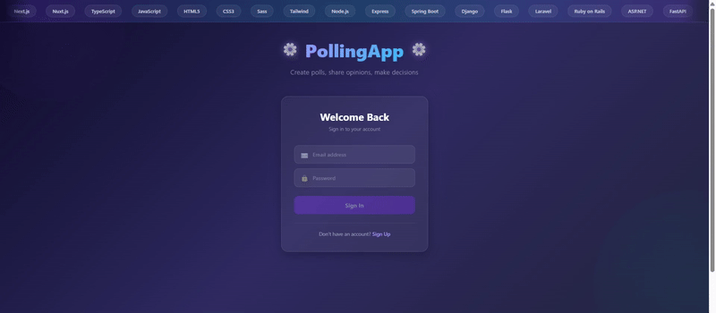

# 📊 Polling App

A full-stack polling application where users can register, create and manage polls, vote, and maintain a personal profile. Built with a Spring Boot REST API and an Angular SPA.

## 🎬 Demo



## Tech Stack

### Backend
| | |
|---|---|
| **Java 21** | Programming language |
| **Spring Boot 4.0.2** | Application framework |
| **Spring Security** | Authentication & authorisation |
| **Spring Data JPA / Hibernate** | ORM and data access |
| **MySQL 8** | Relational database |
| **JWT (jjwt)** | Stateless token-based auth |
| **Lombok** | Boilerplate reduction |
| **JUnit 5 / Mockito** | Unit testing (40 tests) |

### Frontend
| | |
|---|---|
| **Angular 21** | SPA framework (standalone components, `@for` control flow) |
| **TypeScript 5.9** | Type-safe language |
| **RxJS 7.8** | Reactive HTTP and state |
| **Angular Forms** | Template-driven forms with validation |
| **Vitest 4** | Unit test runner (124 tests) |
| **ESLint v9** | Linting (flat config, `@angular-eslint`, `typescript-eslint`) |
| **Prettier 3** | Code formatting |
| **Husky + lint-staged** | Pre-commit quality gates |
| **Custom CSS** | Fully hand-crafted responsive styles |

## Project Structure

```
polling-app/
├── pollingapp/                         # Spring Boot backend
│   └── src/
│       ├── main/java/.../
│       │   ├── controller/             # REST controllers (Auth, Poll, User)
│       │   ├── model/                  # JPA entities (User, Poll, VoteRecord)
│       │   ├── repositories/           # Spring Data repositories
│       │   ├── services/               # Business logic
│       │   ├── security/               # JWT filter, SecurityConfig
│       │   └── request/                # Request/response DTOs
│       └── test/                       # Unit tests
│
└── pollingapp-client/                  # Angular frontend
    ├── src/app/
    │   ├── pages/
    │   │   ├── login/                  # Sign-in / sign-up page
    │   │   └── home/                   # Authenticated home page
    │   ├── components/
    │   │   ├── poll/                   # Poll list, create, vote, delete
    │   │   └── profile/                # Profile view and edit modal
    │   ├── services/                   # AuthService, PollService, UserService
    │   ├── guards/                     # AuthGuard (route protection)
    │   └── models/                     # TypeScript interfaces
    ├── eslint.config.mjs               # ESLint flat config
    ├── .husky/pre-commit               # Pre-commit hook
    └── .prettierignore
```

## ✅ Implemented

### Authentication & Security
- JWT-based stateless authentication (register / login)
- Password hashing with BCrypt
- `AuthGuard` protecting all routes behind login
- HTTP interceptor attaching `Bearer` token to every request
- Strong password validation (length, upper/lower, number, special char)
- Immediate inline error feedback (duplicate email, wrong credentials)

### Poll Management
- Create polls with 2–4 custom options
- View all polls with live vote percentages and counts
- Vote on any poll; change vote (previous option decremented automatically)
- Delete own polls — vote records removed atomically before the poll
- Confirmation modal with keyboard (Escape) and backdrop-click dismissal
- Poll ownership: only the creator sees and can use the delete button

### User Profiles
- View profile (username, email, bio, avatar, member-since date)
- Edit username and bio via modal
- Upload and preview avatar image
- Instant feedback on save success / failure

### Developer Tooling
- **ESLint** — `@angular-eslint`, `typescript-eslint` recommended + stylistic, Prettier integration
- **Prettier** — consistent formatting enforced on save and commit
- **Husky pre-commit hook** — runs `lint-staged` (lint + format changed files) then `tsc --noEmit`
- **124 frontend tests** across 8 spec files (services, guards, interceptor, components)
- **40 backend tests** (JWT, auth service, poll service ownership + vote tracking, user service)

## 🚧 In Progress / Planned

- Advanced poll options (deadlines, multiple-choice, anonymous voting)
- Dashboard with personal poll statistics
- Real-time vote updates via WebSocket
- Pagination / infinite scroll for large poll lists
- Deployment configuration (Docker, CI/CD)

## Development Setup

### Prerequisites
- Java 21
- Node.js 20+ and npm
- MySQL 8
- Maven 3.9+

### Backend Setup
```bash
cd pollingapp
./mvnw spring-boot:run
# API available at http://localhost:8080
```

Run backend tests:

```bash
./mvnw test
```

### Frontend

```bash
cd pollingapp-client
npm install
ng serve
# App available at http://localhost:4200
```

Run frontend tests:

```bash
ng test --watch=false
```

Lint and type-check:

```bash
npm run lint
npm run type-check
```

## License

MIT — see [LICENSE](LICENSE)
